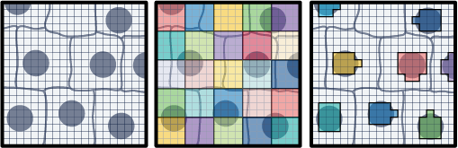

## Learning Objectives

By the end of this exercise, you will be able to:

- Load and manipulate Visium HD segmented data using `SpatialExperiment` and `SpatialFeatureExperiment` objects.
- Compare the data structure and spatial coordinates of binned and segmented Visium HD data.
- Visualize gene expression in both binned and segmented data to understand the differences in resolution and spatial representation.
- Save and export the processed data for downstream analysis.


## Libraries

```{r day1-1c-visium_HD_segmented-1}
#| message: false
#| warning: false
#| output: false

library(scuttle)
library(sf)
library(arrow)
library(dplyr)
library(tidyr)
library(ggplot2)
library(patchwork)
library(SpatialExperiment)
library(SpatialFeatureExperiment)
library(Voyager)
library(VisiumIO)
library(ggspavis)
library(HDF5Array)
library(alabaster.base)
library(alabaster.sfe)
library(fs)
```

Finally, we will work with the **Visium HD segmented output**. This data corresponds to the same sample and region of interest as the binned data from `Exercise 1A`, but instead of being binned, it contains the output of cell segmentation. Since `Space Ranger` version 4, the output of cell segmentation is available as an optional output of the pipeline, and it contains the coordinates of the segmented cells and their boundaries.

<!-- TO DO: we need to make a smaller version of the dataset for the course. Can it include the imgData as well?
Be careful that there are 2 versions of the dataset, one mapped with SpaceRanger 4.0.1 and one with SpaceRanger 4.1.0!!!
https://www.10xgenomics.com/datasets/visium-hd-cytassist-gene-expression-libraries-of-human-crc-v4
https://www.10xgenomics.com/datasets/visium-hd-cytassist-11mm-human-colon-cancer-HE
-->

## Data download 

```{r day1-1c-visium_HD_segmented-2}
options(timeout = 2000)

if (!dir.exists("data/segmented_outputs/")) {
  dir.create("data", showWarnings = FALSE)
  download.file(
    url = "https://cf.10xgenomics.com/samples/spatial-exp/4.0.1/Visium_HD_Human_Colon_Cancer/Visium_HD_Human_Colon_Cancer_segmented_outputs.tar.gz",
    destfile = "data/Visium_HD_Human_Colon_Cancer_segmented_outputs.tar.gz",
    mode = "wb"
  )

  untar(
    tarfile = "data/Visium_HD_Human_Colon_Cancer_segmented_outputs.tar.gz",
    exdir = "data/"
  )

  download.file(
    url = "https://cf.10xgenomics.com/samples/spatial-exp/4.0.1/Visium_HD_Human_Colon_Cancer/Visium_HD_Human_Colon_Cancer_barcode_mappings.parquet",
    destfile = "data/segmented_outputs/Visium_HD_Human_Colon_Cancer_barcode_mappings.parquet",
    mode = "wb"
  )
  
  file.remove("data/Visium_HD_Human_Colon_Cancer_segmented_outputs.tar.gz")
} else {
  message("Data exists, please proceed to next steps!")
}
```

::: callout-important
## Exercise 1
- Which class do you think should be used to store the Visium HD segmented data? `SpatialExperiment` as we used in Exercise 1A or `SpatialFeatureExperiment` as we used in Exercise 1B?
- What does the data for each segmented cell represent? What is the binning strategy? What are the potential limitations?

::: 

::: {.callout-tip collapse="true"}
## Answer
- Since segmented data contains cell boundaries, the coordinates of the segmented cells are not limited to the spot coordinates as in the binned data. Therefore, we will use `SpatialFeatureExperiment` to work with the segmented data, as it allows us to store and visualize spatial features such as cell boundaries, as we did for the Xenium data in Exercise 1B. 
`SpatialExperiment` is more suitable for binned data where the coordinates correspond to the spot centroids on a regular grid and there are no additional spatial features to store.

- The Visium HD still captures the data on 2x2 µm bins. These are partitioned into larger bins based on the cell they correspond to (see Figure below). The partitioning of aggregated bins mimics single-cell data since the UMI counts are reported per segmented cell basis.



One limitation is that a bin can overlap more than one cell, so the assignment of the transcripts captured would be ambiguous. Of course this approach relies also on the quality of the segmentation mask. 
::: 

Here we will proceed in two steps:\
- We start reading the object into a `SpatialExperiment` object and subset it to the region of interest, as we have done for Visium HD binned data in the previous exercises. This allows a quick comparison of the two types of processing for the same slide\
- We then convert the object to create a `SpatialFeatureExperiment` object and add the cell segmentation information to it

## Import into a SpatialExperiment object and subset

```{r day1-1c-visium_HD_segmented-3}
# Define the region of interest
roi_visium <- c(
  xmin = 49000,
  xmax = 58000,
  ymin = 7500,
  ymax = 16000
)
roi_visium
```

```{r day1-1c-visium_HD_segmented-4}
# Read the segmented output into a SpatialExperiment object
spe_seg <- TENxVisiumHD(
  segmented_outputs = "data/segmented_outputs/",
  processing = "raw",
  format = "h5",
  images = "lowres"
) |>
import()

# Use unique Symbol for rownames
rownames(spe_seg) <- uniquifyFeatureNames(
  ID = rowData(spe_seg)$ID,
  names = rowData(spe_seg)$Symbol
)

spe_seg
```

```{r day1-1c-visium_HD_segmented-5}
# Subset to the region of interest
spe_seg <- spe_seg[, spatialCoords(spe_seg)[, 1] >= roi_visium[["xmin"]] &
  spatialCoords(spe_seg)[, 1] <= roi_visium[["xmax"]] &
  spatialCoords(spe_seg)[, 2] >= roi_visium[["ymin"]] &
  spatialCoords(spe_seg)[, 2] <= roi_visium[["ymax"]]]
```

<!--
The slot spe_seg$map includes interesting info, which allows us to calculate the cell area for example
```{r day1-1c-visium-HD-segmented-1, eval=F}
spe_seg$map |> head()
```
--->

Load the previous binned object for comparison:

```{r day1-1c-visium_HD_segmented-6}
spe <- loadHDF5SummarizedExperiment(dir="results/day1/", prefix="01.1a_spe_")
```

::: callout-important
## Exercise 2

Compare the elements in the `colnames` of the two objects, what do they represent? How many elements are there in each object?
:::

::: {.callout-tip collapse="true"}
## Answer

```{r day1-1c-visium_HD_segmented-7}
colnames(spe) |> head()
ncol(spe)
colnames(spe_seg) |> head()
ncol(spe_seg)
```

The object from exercise 1A contains bin IDs, while the new object contains cell IDs. The number of bins is different from the number of cells in the segmented object, since the segmentation process  can lead to a different number of cells compared to the number of bins in the same region of interest.
:::


We can compare visually the spatial coordinates of the two objects: 

```{r day1-1c-visium_HD_segmented-8}
plotVisium(spe, zoom=T)
plotVisium(spe_seg, zoom=T)
```

::: callout-important
## Exercise 3

Compare the expression of `PIGR` gene in the two objects usign the function `plotVisium()` (as previously done in exercise 1A). What do you observe? 
:::


::: {.callout-tip collapse="true"}
## Answer
```{r day1-1c-visium_HD_segmented-9}
#| warning: false
p_vis <- plotVisium(spe,
                    annotate = "PIGR",
                    assay = "counts",
                    zoom = TRUE,
                    point_size = 1,
                    point_shape = 22)

p_vis_seg <- plotVisium(spe_seg,
                      annotate = "PIGR",
                      assay = "counts",
                      zoom = TRUE,
                      point_size = 1,
                      point_shape = 21)
p_vis + p_vis_seg
```

Using visium HD segmented data allows us to have a more detailed view of the tissue, as we are not limited to the resolution of the bins. The x and y coordinates of the `SpatialExperiment` object corresponds to the centroids of the cells.

:::

We can also have access to the full segmentation of the cells (i.e., the boundaries of each segmented cell), but contrary to the `SpatialFeatureExperiment`, this cannot be stored natively in a slot of the `SpatialExperiment` object, so it is stored in the `metadata` of the object.

## Create a `SpatialFeatureExperiment` object 

In order to manipulate the segmentation in an easier way, we create a `SpatialFeatureExperiment` object, which allows us to store and visualize spatial features (e.g., see the `colGeometries()` function used in Exercise 1B). We need to add the cell segmentation boundaries to the list of geometries.


```{r day1-1c-visium_HD_segmented-10}
sfe_seg <- toSpatialFeatureExperiment(spe_seg)
colGeometries(sfe_seg)

## Extract cell segmentation boundaries from the metadata. 
seg <- metadata(sfe_seg)$cellseg
## This was not subsetted to the ROI so we need to do the filtering. The cells are in the same order as the initial unfiltered SpatialExperiment
seg_coords <- st_coordinates(st_centroid(seg))

seg <- seg[seg_coords[, 1] >= roi_visium[["xmin"]] &
             seg_coords[, 1] <= roi_visium[["xmax"]] &
             seg_coords[, 2] >= roi_visium[["ymin"]] &
             seg_coords[, 2] <= roi_visium[["ymax"]], ]
rownames(seg) <- colnames(sfe_seg)

## Add the geometry to the object
colGeometries(sfe_seg)[["cellSeg"]] <- seg
colGeometries(sfe_seg)
```

<!--
Testing import of segmentation data directly from the data/ folder instead 

```{r day1-1c-visium-HD-segmented-2, eval=F}
geo_data <- st_read("data/segmented_outputs/cell_segmentations.geojson")
## Assuming the cells are in the same order
geo_data <- geo_data[spatialCoords(spe_seg)[, 1] >= roi_visium[["xmin"]] &
  spatialCoords(spe_seg)[, 1] <= roi_visium[["xmax"]] &
  spatialCoords(spe_seg)[, 2] >= roi_visium[["ymin"]] &
  spatialCoords(spe_seg)[, 2] <= roi_visium[["ymax"]], ]
geo_data$cell_id <- colnames(sfe_seg)
row.names(geo_data) <- colnames(sfe_seg)
# colGeometries(sfe_seg)[["cellSeg"]] <- geo_data[colnames(sfe_seg), ]

## Importing other segmentations mask, for example it is nice to see the exact segmentation performed by SpaceRanger, or use another method for segmentation?

geo_data <- st_read("data/segmented_outputs/nucleus_segmentations.geojson")
geo_data <- geo_data[spatialCoords(spe_seg)[, 1] >= roi_visium[["xmin"]] &
  spatialCoords(spe_seg)[, 1] <= roi_visium[["xmax"]] &
  spatialCoords(spe_seg)[, 2] >= roi_visium[["ymin"]] &
  spatialCoords(spe_seg)[, 2] <= roi_visium[["ymax"]], ]
geo_data$cell_id <- colnames(sfe_seg)
row.names(geo_data) <- colnames(sfe_seg)
st_crs(geo_data) <- NA_crs_

colGeometries(sfe_seg)[["nucleusSeg"]] <- geo_data[colnames(sfe_seg), ]

plotSpatialFeature(sfe_seg, 
                   colGeometryName="nucleusSeg", 
                   features="PIGR", 
                  exprs_values = "counts")
```
Details on SpaceRanger segmentation algo: https://www.10xgenomics.com/support/software/space-ranger/latest/algorithms-overview/image-processing

-->

<!--
TO DO? 
Julien: could be potentially nice to add the cell area, here is some code inspired from the OSTA book to do it

```{r day1-1c-visium-HD-segmented-3, eval=F}
# get cell area = 4um x number of 2um bins
um2 <- 4*sapply(sfe_seg$map, nrow) 
sfe_seg$um2 <- um2
plotSpatialFeature(sfe_seg, 
                   colGeometryName="cellSeg", 
                   features="um2")

# get fraction of 2um bins that are nuclear
sfe_seg$nuc <- sapply(sfe_seg$map, \(.) mean(.$in_nucleus))
# get nucleus areas = cell area x nuclear fraction
sfe_seg$nuc_um2 <- sfe_seg$um2*sfe_seg$nuc
```

But see below, it's simpler to calculate the area from the geometry directly anyway 
```{r day1-1c-visium-HD-segmented-4, eval=F}
st_area(colGeometries(sfe_seg)[["cellSeg"]]) |> head()
plot(st_area(colGeometries(sfe_seg)[["cellSeg"]]), sfe_seg$um2)
## just a scaling factor, from um^2 to pixels (?)

## Correlated to the total counts
plot(st_area(colGeometries(sfe_seg)[["cellSeg"]]), colSums(counts(sfe_seg)), log="xy")
```

TO DO: Maybe simpler to import directly to SFE with function from SpatialFeatureExperiment package?
```{r day1-1c-visium-HD-segmented-5, eval=F}
sfe3 <- readVisiumHD(data_dir="data/", use_cellseg = TRUE, unit = "full_res_image_pixel")
## TO DO: uniquifyFeatureNames, etc

## Subsetting
sfe3 <- sfe3[, spatialCoords(sfe3)[, 1] >= roi_visium[["xmin"]] &
  spatialCoords(sfe3)[, 1] <= roi_visium[["xmax"]] &
  spatialCoords(sfe3)[, 2] >= roi_visium[["ymin"]] &
  spatialCoords(sfe3)[, 2] <= roi_visium[["ymax"]]]
colGeometries(sfe3)

plot(st_area(colGeometries(sfe3)[["cellSeg"]]), colSums(counts(sfe3)), log="xy")
```

-->

We can visualize the geometries with a simple scatterplot: 

```{r day1-1c-visium_HD_segmented-11}
plot(st_geometry(colGeometries(sfe_seg)[["centroids"]]), 
     col=rep(colors(), 2), 
     pch=16)

plot(st_geometry(colGeometries(sfe_seg)[["cellSeg"]]), 
     col=rep(colors(), 2), 
     lty=0)
```

Or these can be used in wrapper functions such as `plotSpatialFeature()` from the `Voyager` package and plot information of different features on top:

```{r day1-1c-visium_HD_segmented-12}
## Plot the area of the cells. It's easy to calculate it from the geometry using the sf package
sfe_seg$area <- st_area(colGeometries(sfe_seg)[["cellSeg"]])
plotSpatialFeature(sfe_seg, 
                   colGeometryName="cellSeg", 
                   features="area") 

## Plot the expression of PIGR on each segmented cell
plotSpatialFeature(sfe_seg, 
                   colGeometryName="cellSeg", 
                   features="PIGR", 
                   exprs_values = "counts") 
```  


::: callout-important
## BONUS: Exercise 3
Plot the cell segmentation mask of very small region of interest on the slide, for example:

```{r day1-1c-visium_HD_segmented-13}
roi_zoomed <- c(
  xmin = 54500,
  xmax = 55000,
  ymin = 12500,
  ymax = 13000
)
```
What do you observe?
::: 

::: {.callout-tip collapse="true"}
## Answer

```{r day1-1c-visium_HD_segmented-14}
sfe_zoomed <- sfe_seg[, spatialCoords(sfe_seg)[, 1] >= roi_zoomed[["xmin"]] &
                        spatialCoords(sfe_seg)[, 1] <= roi_zoomed[["xmax"]] &
                        spatialCoords(sfe_seg)[, 2] >= roi_zoomed[["ymin"]] &
                        spatialCoords(sfe_seg)[, 2] <= roi_zoomed[["ymax"]]]

plot(st_geometry(colGeometries(sfe_zoomed)[["cellSeg"]]), 
     col=rep(colors(), 2), 
     lty=0)
plotSpatialFeature(sfe_zoomed, 
                   colGeometryName="cellSeg", 
                   features="area")
```

When zooming in, we can clearly see that 2 um bins make up each cell in the dataset.
:::

## Saving the object

In the `Exercise 1A` we used the function `saveHDF5SummarizedExperiment` because the count matrix of the `SpatialExperiment` object is stored on-disk for efficiency.

As you could see above, the `SpatialFeatureExperiment` includes additional layers, and some of them are also not loaded in memory. This complicates things further and even saving the object with the  `saveHDF5SummarizedExperiment` function does not allow to fully re-import it.

A nice way to save the object is to use the `alabaster.sfe` package, implementing a (language agnostic) format to represent `SpatialFeatureExperiment` on disk (see the ArtifactDB project https://github.com/ArtifactDB). See the package vignette here:  https://bioconductor.org/packages/3.23/bioc/vignettes/alabaster.sfe/inst/doc/Overview.html

```{r day1-1c-visium-HD-segmented-6}
# The "cellseg" slot of the metadata is problematic, let's remove it because it's now stored as colGeometry slot 
metadata(sfe_seg) <- metadata(sfe_seg)[1:2]  

# mkdir("results/day1")
alabaster.sfe::saveObject(sfe_seg, "results/day1/01.1c_sfe_visium")
fs::dir_tree("results/day1/01.1c_sfe_visium")
```

For the rest of the exercises, we will use this Visium HD segmented object, but feel free to replace by the binned object (`Exercise 1A`) or the Xenium object (`Exercise 1B`) to compare the results.
